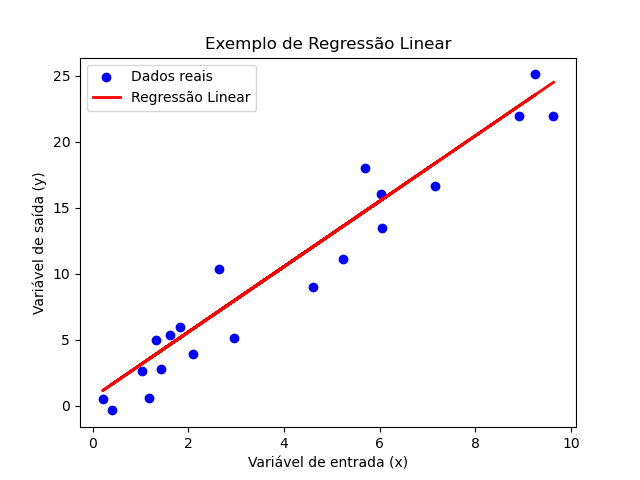
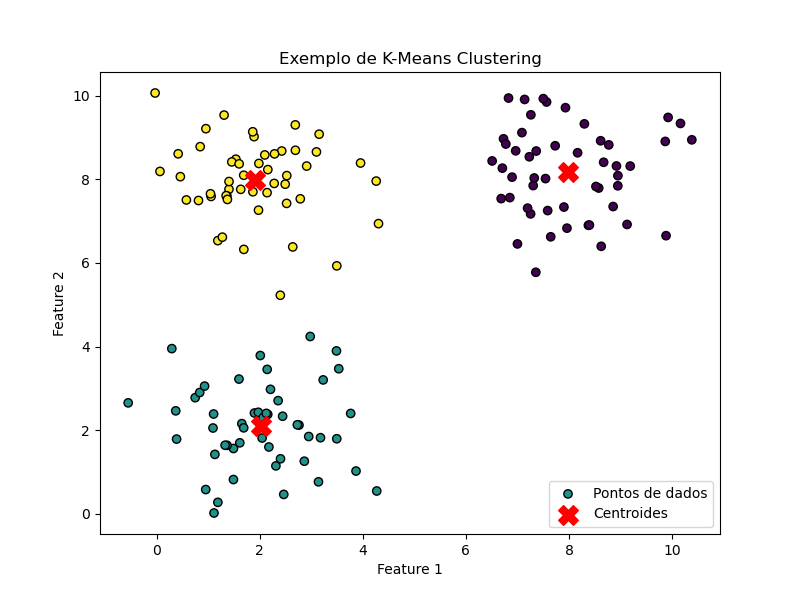
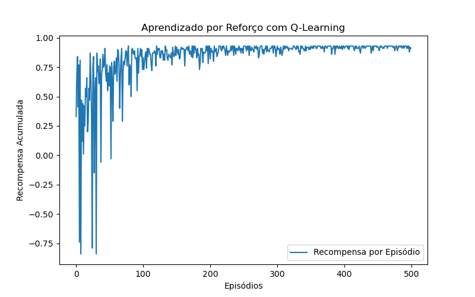

# **Aprendizado de Máquina**

O aprendizado de máquina (Machine Learning - ML) é um subcampo da inteligência artificial que permite que sistemas computacionais aprendam padrões a partir de dados e realizem previsões ou classificações sem serem explicitamente programados para isso. Esse processo ocorre por meio de algoritmos que ajustam seus parâmetros com base em experiências anteriores, tornando-se cada vez mais eficientes na realização de tarefas específicas.

A popularização do aprendizado de máquina se deve ao crescimento exponencial na disponibilidade de dados, ao aumento da capacidade computacional e ao desenvolvimento de algoritmos avançados que possibilitam extrair insights valiosos a partir de grandes volumes de informação. Sua aplicação se estende a diversas áreas, incluindo saúde, finanças, transporte, segurança cibernética, entre outras.

Os algoritmos de aprendizado de máquina são geralmente categorizados em três principais tipos de aprendizado: supervisionado, não supervisionado e por reforço. No aprendizado supervisionado, os modelos são treinados com dados rotulados, onde a saída correta é previamente conhecida. Já no aprendizado não supervisionado, os algoritmos identificam padrões ocultos nos dados sem a necessidade de rótulos. O aprendizado por reforço, por sua vez, utiliza um sistema de recompensa para guiar o modelo na tomada de decisões.

O estudo e aplicação do aprendizado de máquina envolvem diversas técnicas e desafios, como a escolha adequada de algoritmos, a extração de características dos dados, o pré-processamento das informações e o tratamento de problemas como overfitting e underfitting. Além disso, a interpretabilidade dos modelos, por meio de abordagens de inteligência artificial explicável (XAI), tem sido cada vez mais relevante para garantir transparência e confiabilidade nas decisões automatizadas.

Nos próximos tópicos, exploraremos em detalhes os diferentes tipos de aprendizado de máquina, as técnicas utilizadas em classificação e regressão, os principais algoritmos empregados e o impacto das redes neurais e do aprendizado profundo no avanço dessa área.


# **Tipos de Aprendizado de Máquina**

O aprendizado de máquina pode ser dividido em três categorias principais: aprendizado supervisionado, aprendizado não supervisionado e aprendizado por reforço. Cada um desses tipos possui características distintas e é aplicado de acordo com a natureza dos dados e o objetivo do modelo.

### Aprendizado Supervisionado

O aprendizado supervisionado é um dos métodos mais comuns e eficazes de aprendizado de máquina. Ele se baseia no uso de um conjunto de dados rotulado, onde cada entrada possui uma saída associada. O modelo é treinado para reconhecer padrões e prever corretamente as respostas com base nos exemplos apresentados durante o treinamento.

Os algoritmos de aprendizado supervisionado podem ser divididos em dois tipos principais: classificação e regressão. Na classificação, o objetivo é categorizar os dados em classes predefinidas, como identificar se um e-mail é spam ou não. Já na regressão, o objetivo é prever valores contínuos, como o preço de um imóvel com base em suas características.

A seguir, um exemplo de aprendizado supervisionado utilizando Regressão Linear com a biblioteca scikit-learn. O código cria um conjunto de dados fictício, treina um modelo de regressão linear e plota os resultados para visualizar a relação entre as variáveis.

```python
import numpy as np
import matplotlib.pyplot as plt
from sklearn.linear_model import LinearRegression
from sklearn.model_selection import train_test_split

# Gerando dados fictícios
np.random.seed(0)
x = 10 * np.random.rand(100, 1)
y = 2.5 * x + np.random.randn(100, 1) * 2  # Relação linear com ruído

# Dividindo os dados em treino e teste
x_train, x_test, y_train, y_test = train_test_split(x, y, test_size=0.2, random_state=0)

# Criando e treinando o modelo de Regressão Linear
modelo = LinearRegression()
modelo.fit(x_train, y_train)

# Fazendo previsões
y_pred = modelo.predict(x_test)

# Plotando os resultados
plt.scatter(x_test, y_test, color='blue', label='Dados reais')
plt.plot(x_test, y_pred, color='red', linewidth=2, label='Regressão Linear')
plt.xlabel('Variável de entrada (x)')
plt.ylabel('Variável de saída (y)')
plt.legend()
plt.title('Exemplo de Regressão Linear')
plt.show()
```


### Aprendizado Não Supervisionado

No aprendizado não supervisionado, os dados utilizados para o treinamento não possuem rótulos predefinidos. O objetivo desse tipo de aprendizado é identificar padrões e estruturas ocultas nos dados, agrupando informações similares sem uma categorização prévia.

Os principais algoritmos de aprendizado não supervisionado incluem métodos como o K-Means Clustering, que agrupa dados semelhantes em clusters, e Self-Organizing Maps (SOM), que mapeiam padrões de alto nível nos dados. Esse tipo de aprendizado é amplamente utilizado em áreas como segmentação de clientes, análise de anomalias e compressão de dados.

Abaixo um exemplo de **Aprendizado Não Supervisionado** usando o algoritmo **K-Means Clustering**. Esse código gera dados fictícios, aplica o K-Means para agrupar os dados em clusters e plota o resultado.  
 
```python
import numpy as np
import matplotlib.pyplot as plt
from sklearn.cluster import KMeans

# Gerando dados fictícios para agrupamento
np.random.seed(0)
X = np.concatenate([
    np.random.randn(50, 2) + [2, 2],  # Cluster 1
    np.random.randn(50, 2) + [8, 8],  # Cluster 2
    np.random.randn(50, 2) + [2, 8]   # Cluster 3
])

# Aplicando K-Means para encontrar 3 clusters
kmeans = KMeans(n_clusters=3, random_state=0, n_init=10)
kmeans.fit(X)
labels = kmeans.labels_
centroids = kmeans.cluster_centers_

# Plotando os dados e os centróides dos clusters
plt.figure(figsize=(8, 6))
plt.scatter(X[:, 0], X[:, 1], c=labels, cmap='viridis', edgecolors='k', label="Pontos de dados")
plt.scatter(centroids[:, 0], centroids[:, 1], c='red', marker='X', s=200, label="Centroides")
plt.xlabel('Feature 1')
plt.ylabel('Feature 2')
plt.title('Exemplo de K-Means Clustering')
plt.legend()
plt.show()
```

**Explicação:**
1. Geramos dados distribuídos em três grupos distintos.
2. Aplicamos o **K-Means** para encontrar três clusters nos dados.
3. Plotamos os pontos com cores representando seus clusters e marcamos os centróides em **vermelho**.

Este exemplo ilustra como o K-Means pode encontrar padrões sem supervisão e é útil para aplicações como **segmentação de clientes** ou **detecção de padrões**.

### Aprendizado por Reforço

O aprendizado por reforço difere dos outros dois tipos por ser baseado em um sistema de recompensas e penalidades. Nesse modelo, um agente interage com um ambiente e aprende a tomar decisões para maximizar uma recompensa acumulada ao longo do tempo.

Esse tipo de aprendizado é frequentemente utilizado em robótica, jogos e sistemas de controle, onde o agente precisa aprender a executar tarefas complexas sem um conjunto de regras predefinido. Um dos algoritmos mais conhecidos nessa categoria é o Q-Learning, que permite que o agente aprenda políticas ótimas de decisão explorando diferentes ações e observando seus efeitos.

Cada um desses tipos de aprendizado tem aplicações específicas e desempenha um papel crucial no avanço da inteligência artificial, permitindo o desenvolvimento de sistemas mais eficientes e adaptáveis às necessidades do mundo real.

Abaixo um exemplo de **Aprendizado por Reforço** usando o algoritmo **Q-Learning** para ensinar um agente a navegar em um ambiente de grid (labirinto). O código inclui a simulação do agente aprendendo a sair de um ponto inicial até um objetivo, além de um gráfico que mostra a evolução das recompensas ao longo do treinamento.


```python
import numpy as np
import matplotlib.pyplot as plt

# Configuração do ambiente (grid 5x5)
size = 5
num_states = size * size
num_actions = 4  # [0: cima, 1: baixo, 2: esquerda, 3: direita]
goal_state = num_states - 1  # Última célula do grid como objetivo

# Inicialização da Q-table
q_table = np.zeros((num_states, num_actions))
learning_rate = 0.1
discount_factor = 0.9
exploration_rate = 1.0
exploration_decay = 0.995
num_episodes = 500

# Função para converter estado em coordenadas (linha, coluna)
def state_to_coord(state):
    return state // size, state % size

# Função para converter coordenadas em estado
def coord_to_state(row, col):
    return row * size + col

# Função para tomar uma ação no ambiente e obter o próximo estado e recompensa
def step(state, action):
    row, col = state_to_coord(state)
    if action == 0 and row > 0: row -= 1  # Cima
    elif action == 1 and row < size - 1: row += 1  # Baixo
    elif action == 2 and col > 0: col -= 1  # Esquerda
    elif action == 3 and col < size - 1: col += 1  # Direita
    next_state = coord_to_state(row, col)
    reward = 1 if next_state == goal_state else -0.01  # Recompensa apenas na meta
    return next_state, reward

# Treinamento do agente usando Q-Learning
rewards_per_episode = []
for episode in range(num_episodes):
    state = 0  # Estado inicial (canto superior esquerdo)
    total_reward = 0

    while state != goal_state:
        # Escolher ação com exploração/explicação
        if np.random.rand() < exploration_rate:
            action = np.random.choice(num_actions)  # Escolha aleatória (exploração)
        else:
            action = np.argmax(q_table[state])  # Melhor ação conhecida (exploração)

        next_state, reward = step(state, action)
        total_reward += reward

        # Atualizar Q-table
        best_next_action = np.max(q_table[next_state])
        q_table[state, action] += learning_rate * (reward + discount_factor * best_next_action - q_table[state, action])

        state = next_state

    rewards_per_episode.append(total_reward)
    exploration_rate *= exploration_decay  # Decaimento da exploração

# Plotando a evolução da recompensa por episódio
plt.figure(figsize=(8, 5))
plt.plot(rewards_per_episode, label="Recompensa por Episódio")
plt.xlabel("Episódios")
plt.ylabel("Recompensa Acumulada")
plt.title("Aprendizado por Reforço com Q-Learning")
plt.legend()
plt.show()
```




**Explicação:**
1. Criamos um **grid 5x5** onde o agente começa no canto superior esquerdo (estado 0) e precisa alcançar a célula inferior direita (estado final).
2. Implementamos o **Q-Learning**, onde o agente aprende tomando ações e atualizando sua **Q-table**.
3. O agente explora aleatoriamente no início e gradualmente passa a explorar menos (exploration decay).
4. No final, plotamos um gráfico mostrando a evolução das recompensas ao longo dos episódios.

Este código demonstra um exemplo básico de **aprendizado por reforço** e pode ser expandido para ambientes mais complexos, como jogos ou robótica.


# **Algoritmos de Aprendizado Supervisionado**  

## **1. K-Nearest Neighbors (KNN)**  

### **O que é o KNN?**  
O algoritmo **K-Nearest Neighbors** (KNN) é um método simples e intuitivo para **classificação e regressão**. Ele se baseia no princípio de que **pontos de dados semelhantes geralmente estão próximos uns dos outros**. Assim, para classificar um novo ponto, o KNN verifica quais são seus **K vizinhos mais próximos** e decide sua categoria com base na maioria dos vizinhos.  

### **Funcionamento do KNN:**  
1. Definir um valor para **K** (quantidade de vizinhos a serem considerados).  
2. Calcular a distância entre o novo dado e todos os pontos do conjunto de treinamento.  
3. Selecionar os **K pontos mais próximos**.  
4. Para classificação: atribuir a classe mais frequente entre os vizinhos.  
5. Para regressão: calcular a média dos valores dos vizinhos.  

### **Principais características:**  
- **Simples de entender e implementar.**  
- **Não precisa de treinamento explícito**, pois apenas armazena os dados e realiza os cálculos no momento da predição.  
- **Desempenho pode ser afetado por dados ruidosos e alta dimensionalidade.**  

### **Aplicações:**  
- **Reconhecimento de padrões**, como identificação de manuscritos.  
- **Sistemas de recomendação**, agrupando usuários com interesses semelhantes.  
- **Classificação de doenças**, analisando sintomas de pacientes.  

### **Desafios do KNN:**  
- **Lento para grandes volumes de dados**, pois precisa calcular distâncias para todos os pontos do conjunto de treinamento.  
- **Escolha do K ideal** pode afetar a precisão (valores pequenos tornam o modelo sensível a ruídos, valores grandes podem perder detalhes).  

---

## **2. Modelos Lineares**  

Os **modelos lineares** são uma abordagem clássica no aprendizado de máquina supervisionado, baseando-se na suposição de que há uma **relação linear entre as variáveis de entrada e a saída**. Eles podem ser usados tanto para **regressão** quanto para **classificação**.  

### **2.1 Regressão Linear**  
A **Regressão Linear** tenta encontrar uma reta que melhor se ajuste aos dados, minimizando o erro entre as previsões e os valores reais. A equação geral de um modelo linear é:  

\[
Y = W_1 X_1 + W_2 X_2 + ... + W_n X_n + b
\]

Onde:  
- \( Y \) é a variável dependente (previsão).  
- \( X_1, X_2, ..., X_n \) são as variáveis de entrada.  
- \( W_1, W_2, ..., W_n \) são os pesos (coeficientes do modelo).  
- \( b \) é o termo de viés (bias).  

### **Aplicações da Regressão Linear:**  
- **Previsão de preços de imóveis.**  
- **Estimativa de vendas de produtos.**  
- **Modelagem de relações econômicas.**  

### **2.2 Regressão Logística**  
A **Regressão Logística** é usada para **problemas de classificação binária**, como prever se um e-mail é **spam ou não spam**. Em vez de uma reta, a regressão logística usa uma função sigmoide para transformar valores contínuos em probabilidades.  

A equação da regressão logística é:  

\[
P(Y=1) = \frac{1}{1 + e^{-(W_1X_1 + W_2X_2 + ... + W_nX_n + b)}}
\]

Se a probabilidade for maior que um certo limiar (como **0.5**), o modelo classifica o exemplo como **1**, caso contrário, como **0**.  

### **Vantagens dos Modelos Lineares:**  
- **Fáceis de interpretar e implementar.**  
- **Funcionam bem com dados estruturados e de baixa dimensionalidade.**  
- **Rápidos para treinar e prever.**  

### **Desvantagens:**  
- **Não capturam relações não lineares nos dados.**  
- **Sensíveis a outliers**, que podem distorcer os resultados.  
- **Podem ter baixa performance em problemas complexos.**  

---

## **3. Classificadores Bayesianos**  

Os **classificadores bayesianos** são baseados no **Teorema de Bayes**, que expressa a relação entre probabilidades condicionais. Eles são particularmente úteis quando queremos fazer previsões baseadas em distribuições estatísticas de dados.  

### **3.1 Teorema de Bayes**  
O Teorema de Bayes define a probabilidade de um evento \( A \) ocorrer, dado que outro evento \( B \) já ocorreu:

\[
P(A|B) = \frac{P(B|A) \cdot P(A)}{P(B)}
\]

Onde:  
- \( P(A|B) \) é a probabilidade de **A** dado **B** (probabilidade posterior).  
- \( P(B|A) \) é a probabilidade de **B** dado **A**.  
- \( P(A) \) e \( P(B) \) são probabilidades independentes dos eventos.  

### **3.2 Naive Bayes**  
O **Naive Bayes** é um dos classificadores mais usados e assume que as características dos dados são **independentes entre si**. Isso permite cálculos mais rápidos e eficientes.  

### **Vantagens do Naive Bayes:**  
- **Funciona bem com grandes conjuntos de dados.**  
- **Eficiente para texto e problemas de NLP (Processamento de Linguagem Natural).**  
- **Treinamento rápido, pois usa apenas probabilidades.**  

### **Desvantagens:**  
- **A suposição de independência das características pode ser irrealista em alguns casos.**  
- **Desempenho inferior em problemas complexos onde as variáveis são fortemente correlacionadas.**  

### **Aplicações do Naive Bayes:**  
- **Classificação de e-mails (Spam vs. Não Spam).**  
- **Análise de sentimentos em textos.**  
- **Diagnóstico médico baseado em sintomas.**


# **Algoritmos de Aprendizado Não Supervisionado**  

O **aprendizado não supervisionado** é uma abordagem da inteligência artificial em que o modelo aprende **padrões e estruturas nos dados sem rótulos pré-definidos**. Ao contrário do aprendizado supervisionado, onde há um conjunto de dados com entradas e saídas conhecidas, no aprendizado não supervisionado o algoritmo deve identificar padrões por conta própria.  

Dois dos algoritmos mais importantes dentro dessa abordagem são o **K-means Clustering**, utilizado para agrupamento de dados, e o **Self-Organizing Maps (SOM)**, uma técnica baseada em redes neurais que ajuda na visualização de dados de alta dimensão.  

---

## **1. K-means Clustering**  

O **K-means** é um dos algoritmos mais populares de agrupamento (*clustering*). Ele funciona **dividindo um conjunto de dados em K grupos distintos**, onde **K** é um número escolhido previamente pelo usuário. O objetivo do algoritmo é minimizar a variabilidade dentro de cada grupo, garantindo que os pontos dentro de um mesmo cluster sejam semelhantes entre si e diferentes dos pontos em outros clusters.  

### **1.1 Como funciona o K-means?**  

O K-means segue um processo iterativo para encontrar os melhores agrupamentos nos dados:  

1. **Escolha do número de clusters (K):** o usuário define quantos grupos deseja encontrar.  
2. **Inicialização dos centróides:** K pontos iniciais são escolhidos aleatoriamente como os "centros" dos grupos.  
3. **Atribuição de pontos aos clusters:** cada ponto do conjunto de dados é atribuído ao centróide mais próximo.  
4. **Atualização dos centróides:** os centróides são recalculados como a média dos pontos atribuídos a cada cluster.  
5. **Repetição do processo:** os passos 3 e 4 se repetem até que os centróides não mudem mais ou um critério de parada seja atingido.  

### **1.2 Aplicações do K-means**  

O K-means é amplamente utilizado em diversas áreas, como:  

- **Segmentação de clientes:** agrupar consumidores com base em padrões de compra.  
- **Compressão de imagens:** reduzir cores em uma imagem agrupando pixels semelhantes.  
- **Agrupamento de documentos:** organizar textos similares para análise de tópicos.  
- **Detecção de anomalias:** encontrar padrões diferentes dentro de um conjunto de dados.  

### **1.3 Vantagens e Desvantagens**  

**Vantagens:**  
- Simples e fácil de implementar.  
- Rápido para conjuntos de dados médios e grandes.  
- Pode ser utilizado em diferentes tipos de aplicações.  

**Desvantagens:**  
- O número de clusters K deve ser definido previamente, o que pode ser difícil sem conhecimento prévio dos dados.  
- Pode convergir para soluções locais (a escolha inicial dos centróides pode afetar o resultado).  
- Não funciona bem com dados que tenham formas de clusters não esféricas.  

---

## **2. Self-Organizing Maps (SOM - Mapas Auto-organizáveis)**  

O **Self-Organizing Map (SOM)**, ou **Mapa Auto-organizável de Kohonen**, é um tipo especial de **rede neural artificial não supervisionada** que aprende **representações de dados de alta dimensão** em um espaço de menor dimensão, geralmente **duas dimensões**. Ele é amplamente usado para **visualizar dados complexos e identificar padrões ocultos**.  

### **2.1 Como funciona o SOM?**  

O SOM funciona distribuindo os dados em uma grade organizada de neurônios, onde cada neurônio representa um grupo de características semelhantes. O treinamento é feito de maneira iterativa, seguindo os seguintes passos:  

1. **Inicialização:** cria-se uma grade de neurônios com pesos aleatórios.  
2. **Escolha de um ponto de dados:** um exemplo é escolhido aleatoriamente do conjunto de dados.  
3. **Busca do neurônio vencedor:** o neurônio mais próximo do ponto de dados é identificado como **Best Matching Unit (BMU)**.  
4. **Ajuste dos pesos:** os pesos do BMU e de seus neurônios vizinhos são atualizados para se parecerem mais com o exemplo escolhido.  
5. **Repetição do processo:** os passos 2 a 4 são repetidos até que o mapa esteja treinado.  

### **2.2 Aplicações do SOM**  

O SOM é amplamente utilizado para **reduzir a dimensionalidade** e **explorar visualmente dados complexos**. Algumas aplicações incluem:  

- **Visualização de dados:** transformar dados de alta dimensão em mapas 2D compreensíveis.  
- **Reconhecimento de padrões:** usado em diagnósticos médicos para identificar padrões em exames.  
- **Análise de clientes:** usado no marketing para encontrar segmentos de consumidores.  
- **Agrupamento de genes:** aplicado na biologia para organizar genes com funções semelhantes.  

### **2.3 Vantagens e Desvantagens**  

**Vantagens:**  
- Muito útil para visualizar dados complexos em duas dimensões.  
- Permite encontrar relações ocultas nos dados sem necessidade de rótulos.  
- Flexível e pode ser aplicado em diversos contextos.  

**Desvantagens:**  
- O treinamento pode ser demorado para grandes volumes de dados.  
- Os resultados podem ser difíceis de interpretar sem conhecimento especializado.  
- A escolha do tamanho da grade afeta o desempenho do modelo.  

---

## **3. Comparação entre K-means e SOM**  

| Característica       | K-means Clustering | Self-Organizing Maps (SOM) |
|---------------------|------------------|----------------------|
| Tipo de Algoritmo | Agrupamento | Rede Neural Não Supervisionada |
| Entrada de Dados  | Dados numéricos | Dados numéricos e de alta dimensão |
| Saída | K grupos distintos | Mapa organizado de neurônios |
| Interpretação | Simples, cada ponto pertence a um cluster | Complexa, os dados são distribuídos em uma grade |
| Aplicações | Segmentação de clientes, compressão de imagens, agrupamento de documentos | Visualização de dados, reconhecimento de padrões, análise de clientes |

---

## **Conclusão**  

Os algoritmos de aprendizado não supervisionado, como **K-means Clustering e Self-Organizing Maps (SOM)**, são essenciais para explorar grandes volumes de dados sem rótulos.  

- O **K-means Clustering** é simples e eficiente para encontrar grupos em dados, mas exige a definição prévia do número de clusters.  
- O **Self-Organizing Map (SOM)** é uma poderosa ferramenta para visualizar e organizar dados complexos, embora seu treinamento possa ser mais difícil de interpretar.  


# **Aprendizado por Reforço e Q-Learning**  


## **Q-Learning: Aprendizado de Valores**  

O **Q-Learning** é um dos algoritmos mais populares de aprendizado por reforço. Ele pertence à categoria de **aprendizado de valores**, ou seja, busca encontrar a **função de valor de ação** que informa ao agente qual é a melhor ação a ser tomada em cada estado.  

A ideia central do Q-Learning é armazenar um conjunto de valores conhecidos como **Q-values**, que representam a "qualidade" de uma ação em determinado estado. Esses valores são atualizados ao longo do tempo por meio da seguinte equação de aprendizado:  

\[
Q(s, a) \leftarrow Q(s, a) + \alpha \left[ R + \gamma \max_{a'} Q(s', a') - Q(s, a) \right]
\]  

Onde:  

- **\( Q(s, a) \)** → Valor Q para um estado \( s \) e uma ação \( a \).  
- **\( \alpha \)** → Taxa de aprendizado (determina o quão rápido o agente se adapta).  
- **\( R \)** → Recompensa recebida após realizar a ação \( a \) no estado \( s \).  
- **\( \gamma \)** → Fator de desconto (determina o peso das recompensas futuras).  
- **\( \max_{a'} Q(s', a') \)** → Melhor valor Q esperado no próximo estado \( s' \).  

### **Como o Q-Learning Funciona?**  

1. **Inicialização**: O agente cria uma **tabela Q (Q-table)**, geralmente preenchida com zeros.  
2. **Exploração e Exploração**:  
   - O agente **explora** o ambiente escolhendo ações aleatórias para aprender.  
   - O agente **explora** ações que já conhece para maximizar a recompensa.  
3. **Atualização da Q-Table**: Com base nas recompensas recebidas, o agente ajusta seus valores Q.  
4. **Repetição**: O processo se repete até que o agente aprenda a melhor política de decisão.  

---

## **Aplicações do Q-Learning**  

O algoritmo Q-Learning é amplamente utilizado em diversas áreas, incluindo:  

### **3.1 Jogos e Inteligência Artificial**  
- Ensinar **robôs de jogos** a tomar decisões estratégicas (como no xadrez e no Go).  
- Criar **agentes autônomos** em videogames que aprendem a jogar sem intervenção humana.  

### **3.2 Veículos Autônomos**  
- Controlar **carros autônomos** para aprender a dirigir de maneira eficiente.  
- Otimizar trajetórias para evitar obstáculos e minimizar tempo de viagem.  

### **3.3 Robótica**  
- Ensinar **braços robóticos** a executar tarefas sem precisar de programação explícita.  
- Desenvolver drones que aprendem a navegar por diferentes ambientes.  

### **3.4 Finanças e Comércio Eletrônico**  
- Criar **estratégias de negociação automatizadas** em mercados financeiros.  
- Melhorar recomendações de produtos para consumidores em lojas virtuais.  

---

## **Vantagens e Desafios do Q-Learning**  

### **4.1 Vantagens**  
**Aprendizado sem supervisão**: não precisa de dados rotulados, aprende por tentativa e erro.  
**Adaptabilidade**: pode ser aplicado a diferentes tipos de problemas e ambientes.  
**Exploração de soluções inovadoras**: pode encontrar estratégias que não seriam intuitivas para humanos.  

### **4.2 Desafios**  
**Tempo de convergência**: pode levar muitas iterações para aprender a melhor estratégia.  
**Problemas com grandes espaços de estados**: se o número de estados e ações for muito grande, a Q-table pode se tornar **impraticável**.  
**Exploração vs. Exploração**: o equilíbrio entre testar novas ações e usar o conhecimento já adquirido pode ser difícil de ajustar.  

Para resolver alguns desses problemas, variações do Q-Learning foram desenvolvidas, como o **Deep Q-Networks (DQN)**, que utiliza redes neurais para lidar com espaços de estado muito grandes.  


# **Classificação e Regressão no Aprendizado de Máquina**  

No contexto do aprendizado de máquina, **classificação** e **regressão** são duas abordagens fundamentais utilizadas para fazer previsões a partir de dados históricos. Ambos os métodos fazem parte do **aprendizado supervisionado**, onde o modelo é treinado com um conjunto de dados rotulado antes de fazer previsões sobre novos dados.  

### **Classificação**  
A classificação é usada quando o objetivo do modelo é prever rótulos discretos ou categorias. Exemplos comuns incluem:  
- **Detecção de e-mails spam** (spam ou não spam).  
- **Diagnóstico médico** (doente ou saudável).  
- **Reconhecimento de imagens** (identificação de objetos, rostos, etc.).  

Os algoritmos de classificação tentam encontrar padrões que separam diferentes categorias dentro dos dados. Entre os algoritmos populares estão **K-Nearest Neighbors (KNN)**, **Árvores de Decisão**, **Máquinas de Vetores de Suporte (SVM)** e **Redes Neurais**.  

### **Regressão**  
A regressão, por outro lado, é utilizada quando a variável de saída é contínua, ou seja, assume valores numéricos. Exemplos incluem:  
- **Previsão de preços de imóveis** com base em tamanho e localização.  
- **Estimativa de temperatura** para os próximos dias.  
- **Cálculo de vendas futuras** de um produto.  

Os algoritmos de regressão buscam modelar a relação entre as variáveis independentes e a variável dependente. Alguns dos algoritmos mais comuns incluem **Regressão Linear**, **Regressão Polinomial** e **Redes Neurais para séries temporais**.  

**i. Extração de Características**  
Antes de treinar um modelo, é essencial **extrair características** relevantes dos dados brutos. Características são informações extraídas dos dados que ajudam o modelo a tomar decisões precisas.  

**Métodos de Extração de Características:**  
1. **Seleção de atributos** – Escolher apenas as variáveis mais relevantes para evitar ruído nos dados.  
2. **Transformação de dados** – Como converter imagens em números ou palavras em vetores para modelos de NLP.  
3. **Redução de dimensionalidade** – Técnicas como PCA (Principal Component Analysis) ajudam a reduzir a quantidade de características mantendo a informação essencial.  

Por exemplo, em um modelo de reconhecimento de rostos, ao invés de usar a imagem bruta, características como **distância entre olhos e boca, formato do nariz e contorno do rosto** podem ser extraídas e utilizadas para classificar indivíduos corretamente.  

**ii. Pré-processamento de Dados**  
O pré-processamento dos dados é uma etapa crucial para garantir que os modelos de aprendizado de máquina funcionem corretamente. Dados brutos geralmente contêm **ruídos, valores ausentes e formatos inconsistentes**, que precisam ser tratados antes do treinamento.  

**Principais Técnicas de Pré-processamento:**  
1. **Normalização e Padronização** – Transformar os dados para uma escala comum, especialmente útil para algoritmos como Redes Neurais e SVM.  
2. **Tratamento de valores ausentes** – Substituir valores ausentes por médias, medianas ou usar técnicas como interpolação.  
3. **Codificação de variáveis categóricas** – Converter categorias textuais em valores numéricos usando técnicas como One-Hot Encoding.  
4. **Remoção de outliers** – Identificar e eliminar pontos extremos que possam distorcer o modelo.  

Por exemplo, se estivermos trabalhando com um modelo de previsão de preços de imóveis, podemos precisar converter características como "bairro" em números e normalizar valores como "área do imóvel" para que todas as variáveis tenham um impacto equilibrado na previsão.  

**iii. Overfitting e Underfitting**  
Ao treinar um modelo, um dos maiores desafios é encontrar o equilíbrio entre **overfitting (sobreajuste)** e **underfitting (subajuste)**.  

**Overfitting (Sobreajuste)**  
Ocorre quando um modelo se ajusta excessivamente aos dados de treinamento, aprendendo detalhes e ruídos que não são generalizáveis para novos dados. Isso leva a um excelente desempenho no conjunto de treinamento, mas um fraco desempenho no mundo real.  

**Como evitar overfitting?**  
- **Aumentar os dados** (Data Augmentation).  
- **Regularização** (L1/L2, dropout em redes neurais).  
- **Reduzir a complexidade do modelo** (menos camadas, menos parâmetros).  
- **Usar validação cruzada** para garantir que o modelo generalize bem.  

**Underfitting (Subajuste)**  
Ocorre quando o modelo é muito simples para capturar os padrões dos dados, resultando em baixa precisão tanto no treinamento quanto nos testes.  

**Como evitar underfitting?**  
- **Aumentar a complexidade do modelo** (usar mais camadas em redes neurais, adicionar mais termos na regressão).  
- **Fornecer mais dados de treinamento** se o dataset for pequeno.  
- **Treinar por mais tempo** para permitir que o modelo aprenda corretamente.  

Uma boa prática para evitar ambos os problemas é dividir os dados em **treinamento, validação e teste**, garantindo que o modelo não memorize os dados de treino e generalize bem para novos exemplos.  


**Conclusão**  
Classificação e regressão são abordagens essenciais dentro do aprendizado de máquina, aplicadas a uma variedade de problemas do mundo real. No entanto, para obter modelos eficazes, é necessário realizar um bom pré-processamento dos dados, escolher características relevantes e evitar os desafios de **overfitting** e **underfitting**.  


  

---


# **Redes Neurais e Aprendizado Profundo**  

O avanço da inteligência artificial nas últimas décadas foi impulsionado pelo desenvolvimento de **redes neurais artificiais (RNAs)** e técnicas de **aprendizado profundo (deep learning)**. Esses métodos são inspirados no funcionamento do cérebro humano e permitem que máquinas realizem tarefas complexas, como **reconhecimento de imagens, tradução automática e geração de texto**.  


## **1. Redes Neurais Artificiais (RNAs)**  

As **redes neurais artificiais** são modelos computacionais que simulam o funcionamento de neurônios biológicos. Elas são compostas por unidades chamadas **neurônios artificiais**, que realizam cálculos matemáticos para aprender padrões a partir dos dados.  

### **1.1 Estrutura de uma Rede Neural**  

Uma rede neural típica é organizada em **camadas**:  
- **Camada de entrada:** recebe os dados brutos, como pixels de uma imagem ou palavras de um texto.  
- **Camadas ocultas:** realizam transformações matemáticas para extrair padrões dos dados.  
- **Camada de saída:** produz a previsão final, como a categoria de um objeto em uma imagem.  

Cada neurônio realiza um cálculo matemático simples:  

\[
Y = f(WX + b)
\]

Onde:  
- **\( W \)** são os pesos aprendidos pelo modelo.  
- **\( X \)** são os dados de entrada.  
- **\( b \)** é um termo de viés.  
- **\( f \)** é uma função de ativação, como ReLU ou sigmoide.  

---

## **2. Aprendizado Profundo (Deep Learning)**  

O aprendizado profundo é uma subárea das redes neurais que utiliza **múltiplas camadas ocultas** para aprender representações complexas dos dados. Diferente dos modelos tradicionais de aprendizado de máquina, que exigem **engenharia de características manual**, redes profundas aprendem automaticamente as melhores representações dos dados.  

### **2.1 Por que o Deep Learning é poderoso?**  
- **Maior capacidade de aprendizado:** redes profundas podem modelar relações complexas.  
- **Eliminação da engenharia manual de características:** o modelo aprende automaticamente representações úteis.  
- **Aproveitamento do grande volume de dados e do poder computacional atual:** GPUs e TPUs permitem treinar redes muito grandes.  

### **2.2 Principais Arquiteturas de Redes Neurais Profundas**  

O aprendizado profundo evoluiu e deu origem a diferentes tipos de redes neurais, cada uma otimizada para um tipo específico de problema.  

#### **2.2.1 Redes Neurais Convolucionais (CNNs - Convolutional Neural Networks)**  
- Especializadas em **processamento de imagens**.  
- Utilizam **filtros convolucionais** para extrair características como bordas e texturas.  
- Aplicações: reconhecimento facial, detecção de objetos, diagnósticos médicos em imagens.  

#### **2.2.2 Redes Neurais Recorrentes (RNNs - Recurrent Neural Networks)**  
- Projetadas para **dados sequenciais**, como texto e séries temporais.  
- Possuem **memória** para armazenar informações anteriores e entender contexto.  
- Aplicações: tradução automática, reconhecimento de fala, previsões financeiras.  

#### **2.2.3 Redes Transformers**  
- Utilizam o **mecanismo de atenção**, permitindo processar informações de maneira eficiente.  
- São a base de modelos como o **GPT (Generative Pre-trained Transformer)** e **BERT (Bidirectional Encoder Representations from Transformers)**.  
- Aplicações: geração de texto, chatbots, assistentes virtuais.  

---

## **3. Treinamento de Redes Neurais**  

O treinamento de uma rede neural envolve ajustar os **pesos \( W \)** e o **viés \( b \)** para minimizar o erro entre as previsões e os valores reais. Esse processo é feito por meio de **gradiente descendente e backpropagation**:  

1. **Propagação direta (Forward Pass):** os dados passam pela rede e geram uma previsão.  
2. **Cálculo do erro (Loss Function):** mede a diferença entre a previsão e o valor real.  
3. **Backpropagation:** o erro é propagado de volta para ajustar os pesos.  
4. **Otimização (Gradient Descent):** ajusta os pesos para minimizar o erro.  

### **3.1 Funções de Ativação**  
As redes neurais utilizam funções de ativação para introduzir **não linearidade** nos cálculos, permitindo que aprendam padrões mais complexos. Algumas das principais funções de ativação são:  
- **ReLU (Rectified Linear Unit):** usada em CNNs para imagens.  
- **Sigmoide:** útil para classificações binárias.  
- **Softmax:** utilizada para problemas de classificação multiclasse.  

---

## **4. Desafios das Redes Neurais e do Deep Learning**  

Apesar de seu sucesso, redes neurais profundas possuem desafios importantes:  

### **4.1 Overfitting (Sobreajuste)**  
- Redes profundas podem **memorizar** os dados de treinamento, prejudicando a generalização para novos dados.  
- **Solução:** técnicas como dropout, aumento de dados e regularização.  

### **4.2 Alto Custo Computacional**  
- Treinar modelos profundos requer **grandes quantidades de dados e poder computacional** (GPUs e TPUs são frequentemente usadas).  
- **Solução:** técnicas como redes pré-treinadas e aprendizado transferido.  

### **4.3 Explicabilidade (XAI - Explainable AI)**  
- Modelos de deep learning são frequentemente chamados de **"caixas-pretas"**, pois não é fácil entender como tomam decisões.  
- **Solução:** métodos como Grad-CAM e LIME tentam explicar as decisões dos modelos.  

---

## **5. Aplicações do Deep Learning no Mundo Real**  

### **5.1 Visão Computacional**  
- **Reconhecimento facial (ex.: desbloqueio de celulares).**  
- **Detecção de doenças em exames médicos.**  
- **Carros autônomos (identificação de sinais e pedestres).**  

### **5.2 Processamento de Linguagem Natural (NLP)**  
- **Tradução automática (ex.: Google Translate).**  
- **Chatbots e assistentes virtuais (ex.: ChatGPT, Alexa, Siri).**  
- **Análise de sentimentos em redes sociais.**  

### **5.3 Jogos e Simulações**  
- **Redes neurais foram usadas para criar a AlphaGo, que venceu campeões humanos no jogo Go.**  
- **Simulações complexas, como previsão do clima e modelagem molecular.**  

---

## **Conclusão**  

As redes neurais artificiais e o aprendizado profundo revolucionaram a inteligência artificial, permitindo avanços impressionantes em **visão computacional, linguagem natural e diversas outras áreas**. No entanto, ainda existem desafios como **overfitting, alto custo computacional e falta de interpretabilidade**, que continuam sendo explorados pela comunidade científica.  


# **Explainable Artificial Intelligence (XAI) – Inteligência Artificial Explicável**  

A Inteligência Artificial (IA) tem se tornado uma ferramenta essencial em diversas áreas, desde diagnósticos médicos até decisões financeiras e veículos autônomos. No entanto, muitos dos modelos de **aprendizado profundo (Deep Learning)** e **aprendizado de máquina (Machine Learning)** são considerados **"caixas-pretas"**, ou seja, suas decisões são difíceis de interpretar.  

A **Inteligência Artificial Explicável (XAI – Explainable Artificial Intelligence)** surgiu como um campo de pesquisa que busca **tornar os modelos de IA mais transparentes, interpretáveis e confiáveis**. O objetivo é fornecer justificativas claras para as previsões dos modelos, garantindo maior confiança e responsabilidade no uso da IA.  

---

## **1. Por que a IA Explicável é Necessária?**  

À medida que a IA é aplicada em **áreas críticas**, como **saúde, segurança e justiça**, torna-se fundamental entender como ela toma suas decisões. Algumas razões para isso incluem:  

### **1.1 Confiabilidade e Transparência**  
- Usuários e especialistas precisam confiar nos sistemas de IA.  
- Empresas e organizações precisam garantir que as decisões tomadas por IA sejam **compreensíveis e auditáveis**.  

### **1.2 Ética e Justiça**  
- Modelos de IA podem refletir **viés nos dados**, levando a decisões injustas.  
- Exemplo: um sistema de recrutamento baseado em IA pode favorecer certos grupos sociais devido a **dados históricos enviesados**.  

### **1.3 Regulamentações e Conformidade**  
- Leis como o **GDPR (Regulamento Geral de Proteção de Dados da União Europeia)** exigem que as organizações expliquem decisões automatizadas.  
- Setores como **finanças e saúde** precisam justificar decisões para evitar **riscos legais**.  

### **1.4 Depuração e Melhoria de Modelos**  
- **Engenheiros de IA precisam entender os erros dos modelos para melhorá-los**.  
- Com explicabilidade, é possível identificar **falhas e viés no treinamento**.  

---

## **2. Tipos de Explicabilidade em IA**  

A explicabilidade pode ser abordada de diferentes maneiras:  

### **2.1 Explicabilidade Global vs. Local**  
- **Explicabilidade Global:** compreende o modelo inteiro, identificando quais recursos influenciam mais suas decisões.  
- **Explicabilidade Local:** foca em explicar uma decisão específica do modelo para um dado individual.  

### **2.2 Modelos Interpretabis vs. Modelos Caixa-Preta**  
- **Modelos Interpretáveis:** métodos mais simples, como **árvores de decisão** e **regressões lineares**, onde os cálculos são diretos e compreensíveis.  
- **Modelos Caixa-Preta:** redes neurais profundas e algoritmos complexos, que precisam de técnicas especiais para interpretação.  

---

## **3. Métodos de Explicabilidade em IA**  

Para entender como os modelos de IA tomam decisões, diversas técnicas foram desenvolvidas.  

### **3.1 SHAP (Shapley Additive Explanations)**  
- Baseado na **teoria dos jogos**, mede a contribuição de cada variável na decisão final do modelo.  
- Ajuda a entender **quanto cada característica influenciou a previsão**.  

### **3.2 LIME (Local Interpretable Model-Agnostic Explanations)**  
- Cria **modelos mais simples** ao redor de uma predição específica para entender quais variáveis influenciaram a decisão.  
- Funciona bem com redes neurais e outros modelos complexos.  

### **3.3 Grad-CAM (Gradient-weighted Class Activation Mapping)**  
- Utilizado em **redes neurais convolucionais (CNNs)** para visão computacional.  
- Gera **mapas de calor** para mostrar quais partes da imagem influenciaram a decisão do modelo.  

### **3.4 Feature Importance (Importância das Características)**  
- Determina **quais variáveis** tiveram maior impacto nas previsões.  
- Pode ser calculado diretamente para modelos como **árvores de decisão** e **florestas aleatórias**.  

---

## **4. Aplicações da XAI**  

A IA Explicável está sendo aplicada em diversos setores para garantir decisões mais transparentes e confiáveis.  

### **4.1 Saúde**  
- **Diagnósticos médicos**: explicar por que um modelo previu uma doença em um paciente.  
- **Pesquisa farmacêutica**: entender quais fatores influenciam a descoberta de novos medicamentos.  

### **4.2 Finanças**  
- **Aprovação de crédito**: justificar por que um cliente recebeu ou não um empréstimo.  
- **Detecção de fraudes**: indicar quais padrões levaram a uma transação ser considerada suspeita.  

### **4.3 Segurança e Justiça**  
- **Reconhecimento facial**: garantir que o modelo não tenha viés racial ou de gênero.  
- **Sistemas de recomendação**: explicar por que um usuário recebeu certas sugestões em plataformas online.  

---

## **5. Desafios da XAI**  

Apesar dos avanços, a implementação da IA Explicável ainda enfrenta desafios importantes:  

### **5.1 Complexidade dos Modelos**  
- Redes neurais profundas possuem milhões de parâmetros, tornando difícil interpretar suas decisões.  
- Algumas técnicas de explicabilidade podem simplificar **excessivamente** os resultados, levando a explicações imprecisas.  

### **5.2 Viés nos Dados e no Processo de Explicação**  
- Se os dados de treinamento forem enviesados, o modelo poderá reforçar esse viés.  
- Mesmo métodos de XAI podem ser manipulados para dar explicações **parciais ou enganosas**.  

### **5.3 Equilíbrio entre Precisão e Explicabilidade**  
- Muitas vezes, modelos mais interpretáveis são menos precisos do que modelos complexos de aprendizado profundo.  
- Encontrar um **equilíbrio** entre interpretabilidade e desempenho é um grande desafio.  

---

## **6. O Futuro da IA Explicável**  

O campo da XAI continua evoluindo, com novas técnicas sendo desenvolvidas para tornar a IA mais transparente e justa. Algumas tendências incluem:  

- **Modelos mais interpretáveis desde o início** (em vez de apenas tentar explicar modelos já treinados).  
- **Integração de XAI em regulamentações** para tornar decisões de IA mais auditáveis.  
- **Desenvolvimento de novas ferramentas de visualização** para facilitar a interpretação dos modelos.  

À medida que a IA se torna mais presente no nosso cotidiano, a **explicabilidade será essencial para garantir seu uso responsável e ético**.  

---

## **Conclusão**  

A Inteligência Artificial Explicável (XAI) é um campo crucial para garantir que os modelos de IA sejam **transparentes, confiáveis e justos**. Com o uso de técnicas como **SHAP, LIME e Grad-CAM**, é possível entender melhor como os modelos tomam decisões e corrigir possíveis falhas ou vieses.  


---


# Referências bibliográficas

1. Bishop, C. M. (2006). *Pattern Recognition and Machine Learning*. Springer.
2. Goodfellow, I., Bengio, Y., & Courville, A. (2016). *Deep Learning*. MIT Press.
3. Sutton, R. S., & Barto, A. G. (2018). *Reinforcement Learning: An Introduction*. MIT Press.
4. Murphy, K. P. (2012). *Machine Learning: A Probabilistic Perspective*. MIT Press.
5. Hastie, T., Tibshirani, R., & Friedman, J. (2009). *The Elements of Statistical Learning: Data Mining, Inference, and Prediction*. Springer.
6. Mitchell, T. M. (1997). *Machine Learning*. McGraw-Hill.
7. Shalev-Shwartz, S., & Ben-David, S. (2014). *Understanding Machine Learning: From Theory to Algorithms*. Cambridge University Press.
8. Chollet, F. (2018). *Deep Learning with Python*. Manning Publications.
9. Ribeiro, M. T., Singh, S., & Guestrin, C. (2016). "Why should I trust you?" Explaining the predictions of any classifier. *Proceedings of the 22nd ACM SIGKDD International Conference on Knowledge Discovery and Data Mining*.
10. Xu, R., & Wunsch, D. (2005). *Clustering*. Wiley-Interscience.
11. Kohonen, T. (2001). *Self-Organizing Maps*. Springer.
12. MacKay, D. J. C. (2003). *Information Theory, Inference, and Learning Algorithms*. Cambridge University Press.
13. Zhang, X., & Chen, L. (2020). "A Comprehensive Review on Deep Reinforcement Learning." *Neural Networks*.
14. Krizhevsky, A., Sutskever, I., & Hinton, G. E. (2012). "ImageNet Classification with Deep Convolutional Neural Networks." *Neural Information Processing Systems (NeurIPS)*.
15. Koller, D., & Friedman, N. (2009). *Probabilistic Graphical Models: Principles and Techniques*. MIT Press.